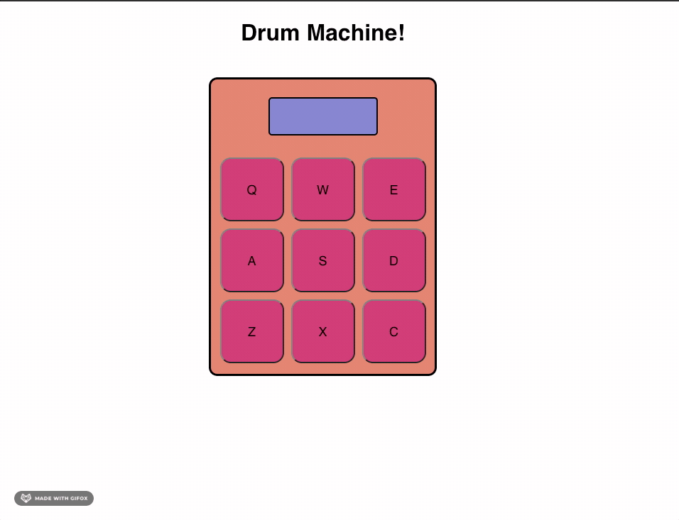
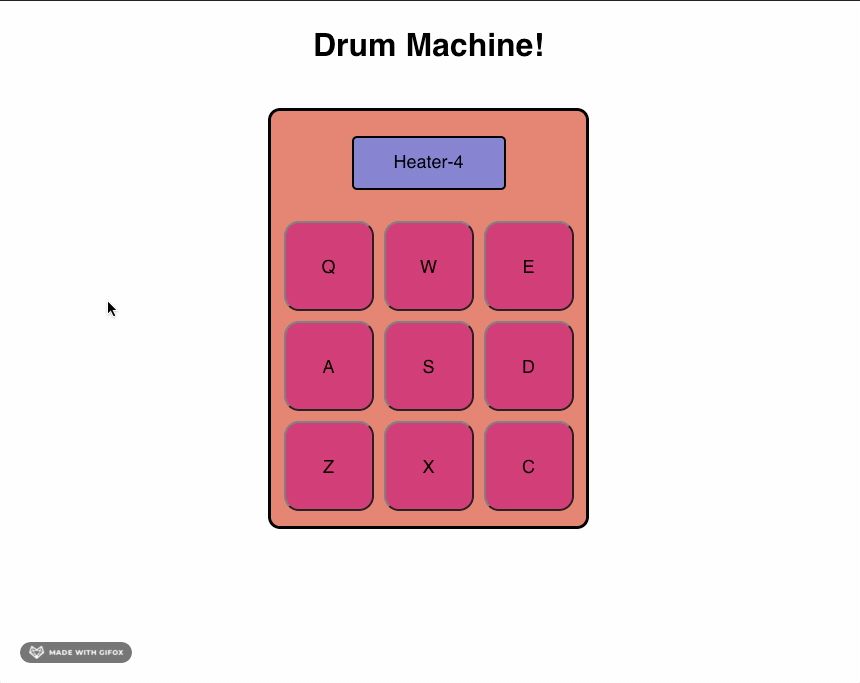

# Drum Machine

This is a drum machine which plays 9 different sounds after a user clicks on the relevant buttons on page or presses the appropriate key.

I created this using codepen.io, and it can be viewed [here](https://codepen.io/tory24/full/dypNqGo).

### Why?

I created this drum machine as part of FreeCodeCamp's Front End Libraries course. It is one of the final 5 challenges needed to complete in order to pass the course.
The aim is to create an app that uses front end libraries, which were taught through the course. I chose to use React.js, as I believe it is the most useful front end library to become familiar with while I'm just starting out.

### Preview
#### Keypress

#### Click

#### Notes
* I hope to update eventually by adding a modifier which allows for 9 new sounds
* Also I hope to make it a bit more interesting by adding a theme, maybe Star Wars or something along those lines.